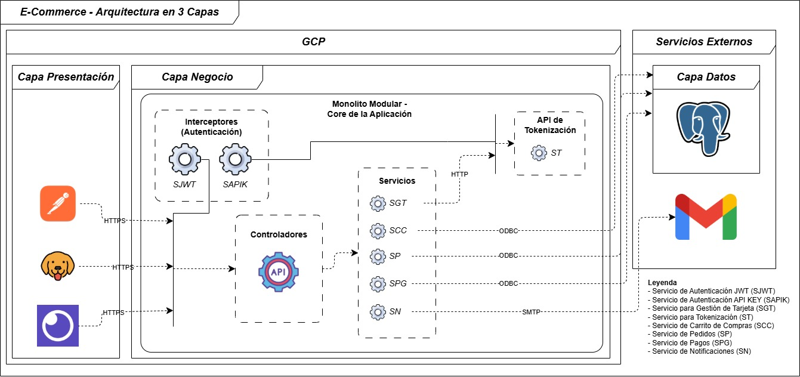

# Stack Tecnológico 
| Recurso         | Versión     | Descripción de uso                                                                                                          |
|:----------------|:------------|:----------------------------------------------------------------------------------------------------------------------------|
| **Java**        | `JDK 21`    | Paquete de desarrollo para las librerias de Java.                                                                           |
| **Spring Boot** | `3.5.7`     | Framework para el desarrollo de la API Rest, junto a sus req de seguridad, gestión de datos y empaquetado de la aplicación. |
| **PostgreSQL**  | `17`        | Base de datos utilizado para la gesión y persistencia de los datos a almacenar.                                             |
| **Docker**      | `4.50.0`    | Sistema empaquedator de dependencias para el despliegue del sistema.                                                        |
| **Neon.tech**   | `---`       | Proveedor del servicio de base de datos para la gestion, disponibilidad y persistencia de los datos en la nube.             |
| **Windows 10**  | `22H2`      | Sisteme operativo utilizado para el desarrollo del sistema.                                                                 |

---

# Dependencias Implementadas

| Tipo              | Dependencia (Maven ArtifactId)          | Versión (Aprox.) | Propósito Principal                                         |
|:------------------|:----------------------------------------|:-----------------|:------------------------------------------------------------|
| **Framework**     | `spring-boot-starter-web`               | 3.5.7            | Servidor web REST (Tomcat, Spring MVC).                     |
| **Persistencia**  | `spring-boot-starter-data-jpa`          | 3.5.7            | ORM con Hibernate y Spring Data Repositories.               |
| **Base de Datos** | `postgresql`                            | -                | Driver de conexión a **PostgreSQL**.                        |
| **Seguridad**     | `spring-boot-starter-security`          | 3.5.7            | Framework principal de autenticación/autorización.          |
| **Cifrado/JWT**   | `jjwt-api`, `jjwt-impl`, `jjwt-jackson` | 0.12.7           | Creación, firma y validación de **JSON Web Tokens**.        |
| **Utilidades**    | `lombok`                                | -                | Reducción de *boilerplate* (Getters/Setters/Constructores). |
| **Validación**    | `jakarta.validation-api`                | 3.0.2            | Validación de DTOs de entrada (`@NotBlank`, `@Email`).      |

---

# Ejecución Local del Proyecto

## 1. Descarga del Repositorio

Para la ejecución local del proyecto, es importante tener el repositorio de [GitHub](https://github.com/Betoloti24/e-commerce-farmatodo).

```batch
    git clone https://github.com/Betoloti24/e-commerce-farmatodo
```

**NOTA:** `Asegurarse de tener acceso a la nube de GitHub por limitaciones en la región, o proxy preconfigurado.`

## 2 Parametrización de la Colección Postman

En el directorio `.doc` se encuentra un archivo llamado collections.json, que posee toda la colección de las rutas y configuraciones para el envío de solicitudes HTTP.

Simplemente abra la aplicación de Postman y en el botón de `Import` añada el archivo mencionado. El sistema se encargará de crear toda la colección del proyecto.


Luego de esto, entra a la sección de `Variables` en la carpeta raiz, y configura el valor de X_API_KEY, ya que el resto de los valores se establecen luego de ejecutar la aplicación.

## 3.0 Instalación con IntelliJ V 2025.2.4

Puedes tener cualquier versión estable del IntelliJ que soporte las versiones de las dependiencias así como del stack tecnológico (lo que aplique).

1. Abre el IntelliJ en el directorio del proyecto que descargaste del repositorio.
2. Espera a que el IDE se encargue de instalar las dependencias y preparar el proyecto.
3. Actualice el archivo de application.properties, con las variables de entorno para la ejecución local.

```properties
    # Base de datos en PostgreSQL
    # NOTA: Spring mapea automáticamente SPRING_DATASOURCE_URL, pero es más explícito usar la referencia:
    spring.datasource.url=${DB_URL}
    spring.datasource.username=${DB_USERNAME}
    spring.datasource.password=${DB_PASSWORD}

    # Autenticacion JWT y API KEY
    jwt.secret.key=${JWT_SECRET_KEY}
    security.api-key.tokenization=${API_KEY_TOKENIZATION_SECRET}
    
    # Cifrado AES-256 GCM
    crypto.aes.secret.key=${AES_CRYPTO_SECRET}
    
    # Servidor para envio de correos
    spring.mail.username=${MAIL_USERNAME}
    spring.mail.password=${MAIL_PASSWORD}
    
    # Tokenizacion
    tokenization.header.name=${TOKENIZATION_HEADER_NAME}
    tokenization.service.url=${TOKENIZATION_SERVICE_URL}
```

**NOTA 1:** `Si alguna de las variables está mal parametrizada, el sistema puede no ejecutarse o en su defecto fallar en algunas funcionalidades.`
**NOTA 2:** `El valor de security.api-key.tokenization, debe ser igual al establecido en la variable de colección en Postman.`

3. Asegurse de tener seleccionado en la sección de ejecución el archivo principal del proyecto y no el de pruebas `(ApigetwayApplication.java)`.
4. Pulsa el boton de iniciar ▶️ en el IDE, y espere a que termine de ejecutar el proyecto antes de enviar peticiones desde la colección de Postman.

## 3.1 Instalación con Imagen Docker

Primero debe tener instalado el docker en su ordenador. Luego de que valide esto, hay que proceder con la creación del ejecutable del proyecto `(.jar)`, para ello 
debe ejecutar en el terminal estando en el directorio del proyecto, junto a todos los datos del archivo .properties, esto porque luego de empaquetar se ejecuta el paquete generado.

```batch
    mvn clean package
```

**NOTA:** `El archivo .properties debe estar en formato UTF-8. Sí hay algún valor con caracteres que no pertenezcan, la ejecución arrojará un error.`

Espere a que el empaquetador se encargue de crear el ejecutable del proyecto.

Cuando el terminal muestre el siguiente resultado:

```batch
    [INFO] ------------------------------------------------------------------------
    [INFO] BUILD SUCCESS
    [INFO] ------------------------------------------------------------------------
    [INFO] Total time:  27.890 s
    [INFO] Finished at: 2025-11-13T10:52:50-04:00
    [INFO] ------------------------------------------------------------------------
```

Procedemos con la creación de la imagen docker en el directorio.


```batch
    # -t: Etiqueta la imagen con un nombre y versión (farmatodo-apigetway:latest)
    docker build -t farmatodo-apigetway:latest .
```

**NOTA:** `Restablezca el archivo .properties sin el valor de las claves parametrizadas, ya que en la creación del contenedor se enviaran los parametros.`

Si la creación de la imagen no arroja algún error, procedemos con la creación del contenedor. Actualiza los valores parametrizados `({VALUE})` con los datos
establecidos en el .properties inicial. No olvides que para valores de tipo cadena debes encerrar el valor en `""`.

```batch
docker run -d \
    -p 8080:8080 \
    --name apigetway-test \
    -e DB_URL={DB_URL}
    -e DB_USERNAME={DB_USERNAME} \
    -e DB_PASSWORD={DB_PASSWORD} \
    -e JWT_SECRET_KEY={JWT_SECRET_KEY} \
    -e API_KEY_TOKENIZATION_SECRET={API_KEY_TOKENIZATION_SECRET} \
    -e AES_CRYPTO_SECRET={AES_CRYPTO_SECRET} \
    -e MAIL_USERNAME={MAIL_USERNAME} \
    -e MAIL_PASSWORD={MAIL_PASSWORD} \
    -e TOKENIZATION_HEADER_NAME={TOKENIZATION_HEADER_NAME} \
    -e TOKENIZATION_SERVICE_URL={TOKENIZATION_SERVICE_URL} \
    farmatodo-apigetway:latest
```

**NOTA:** `Este comando solo se ejecuta en powershell, para reconocer los saltos de línea en la instrucción.`

Al finalizar la ejecución, debería arrojar una clave hash que identifica el contenedor creado, y que ya se encuentra en ejecución, simplemente queda 
es utilizar la colección de postman para consultar. 

---

# Diagramas de la Aplicación


## Diagrama de Arquitectura



## Diagrama del Modelo Relacional


# Detalle de la Implementación de Seguridad

La seguridad se implementa bajo un esquema **Bearer Token (JWT)**, garantizando que el servidor permanezca sin estado (`Stateless`).

## A. Cifrado de Contraseñas (Password Hashing)

* **Algoritmo:** **BCrypt** (`BCryptPasswordEncoder`).
* **Implementación:** Utilizado en el `AuthService` para cifrar la contraseña antes de almacenarla. Este algoritmo es el estándar recomendado por Spring Security debido a su costo computacional y uso de *salt* (sal) por defecto, protegiendo contra ataques de tablas *rainbow*.

## B. Flujo de Autenticación con JWT

| Componente | Descripción Detallada | Clase(s) Asociada(s) |
| :--- | :--- | :--- |
| **Token JWT** | Tokens firmados digitalmente con el algoritmo **HS256**. Contienen el nombre de usuario (`subject`) y los roles (`claims`) para la autorización. | `JwtService` |
| **Carga de Usuario** | **`ClientDetailsService`** implementa `UserDetailsService`, permitiendo que Spring Security cargue al usuario (`Client`) desde la DB para la validación de la contraseña en el login y la asignación de autoridades. | `ClientDetailsService` |
| **Filtro de Token** | **`JwtAuthFilter`** se ejecuta `Before` el filtro estándar de autenticación de Spring. Intercepta el encabezado `Authorization: Bearer <token>`, valida el JWT y establece manualmente la identidad en el `SecurityContextHolder`. | `JwtAuthFilter` |
| **Gestión de Sesión** | La configuración de seguridad establece la política de creación de sesión en **`SessionCreationPolicy.STATELESS`**, inhabilitando el uso de sesiones HTTP y obligando a cada petición a llevar el token para autenticarse. | `SecurityConfig` |

---

# Controladores y URLs

Esta documentación detalla los endpoints disponibles para la gestión de usuarios, tarjetas, carrito, pedidos y configuración del sistema.

- - -

## Estructura de Respuesta Estandarizada

Todas las respuestas de la API utilizan un formato JSON genérico que envuelve los datos del payload.

### Objeto Base: `ApiResponse<T>`

| Campo | Tipo | Descripción | Ejemplo |
| --- | --- | --- | --- |
| `error` | Boolean | `true` si la operación falló, `false` si fue exitosa. | `false` |
| `status` | Integer | Código de estado HTTP retornado. | `200` |
| `message` | String | Mensaje descriptivo del resultado de la operación. | `"Autenticación exitosa."` |
| `data` | T   | El payload de datos real de la respuesta. Su estructura varía según el endpoint. | `{ ... }` |

- - -

## 1\. Controlador de Autenticación (`/api/v1/auth`)

Endpoints para el registro de nuevos clientes y la obtención de tokens de acceso.

### 1.1. Registrar Cliente

*   **Ruta:** `/api/v1/auth/register`
*   **Método:** `POST`
*   **Autenticación:** Pública (Ninguna)

#### Cuerpo de la Petición (JSON)

```
{
    "username": "usuario.prueba",
    "password": "PasswordSegura123",
    "email": "prueba@ejemplo.com",
    "firstName": "Juan",
    "firstSurname": "Perez",
    "middleName": null,
    "secondSurname": null,
    "phoneNumber": "5551234567"
}
```

#### Respuesta (201 CREATED)

```
{
    "error": false,
    "status": 201,
    "message": "Usuario registrado con éxito. ID: [UUID]",
    "data": null
}
```

#### Posibles Errores

*   **400 BAD REQUEST:** Error de validación o si el usuario ya existe.
*   **500 INTERNAL SERVER ERROR:** Fallo al asignar el rol por defecto.

### 1.2. Iniciar Sesión

*   **Ruta:** `/api/v1/auth/login`
*   **Método:** `POST`
*   **Autenticación:** Pública (Credenciales en cuerpo)

#### Cuerpo de la Petición (JSON)

```
{
    "username": "usuario.prueba",
    "password": "PasswordSegura123"
}
```

#### Respuesta (200 OK)

```
{
    "error": false,
    "status": 200,
    "message": "Autenticación exitosa.",
    "data": {
        "token": "eyJhbGciOiJIUzI1NiI...",
        "type": "Bearer"
    }
}
```

#### Posibles Errores

*   **401 UNAUTHORIZED:** Credenciales de login inválidas.

- - -

## 2\. Controlador de Tarjetas (`/api/v1/card`)

Endpoints para la gestión de tarjetas tokenizadas. Requiere JWT para GET y API Key para POST (Tokenización).

### 2.1. Tokenizar y Almacenar Tarjeta

*   **Ruta:** `/api/v1/card`
*   **Método:** `POST`
*   **Autenticación:** Header `X-API-KEY` (Requiere `ROLE_TOKENIZATION_SERVICE`)

#### Cuerpo de la Petición (JSON)

```
{
    "clientId": "[UUID del Cliente]",
    "cardNumber": "4000123456789010",
    "cvv": "123",
    "expirationMonth": "12",
    "expirationYear": "28"
}
```

#### Respuesta (201 CREATED)

```
{
    "error": false,
    "status": 201,
    "message": "Tarjeta tokenizada y almacenada con éxito.",
    "data": {
        "cardId": "[UUID de la tarjeta]",
        "token": "9f86d081884c...",
        "lastFourDigits": "9010",
        "message": "Tarjeta tokenizada y almacenada con éxito."
    }
}
```

#### Posibles Errores

*   **400 BAD REQUEST:** Datos de tarjeta inválidos (Luhn/CVV/Expiración) o rechazo en la tokenización.
*   **403 FORBIDDEN:** Falta o API Key inválida (fuera del scope de este controlador, manejado en SecurityConfig).
*   **500 INTERNAL SERVER ERROR:** Error de comunicación con el servicio de tokenización o fallo interno de cifrado/persistencia.

### 2.2. Obtener Todas las Tarjetas del Cliente

*   **Ruta:** `/api/v1/card/get-all`
*   **Método:** `GET`
*   **Autenticación:** Header `Authorization: Bearer [JWT]`

#### Respuesta (200 OK)

```
{
    "error": false,
    "status": 200,
    "message": "Tarjetas recuperadas con éxito.",
    "data": [
        {
            "cardId": "[UUID Tarjeta 1]",
            "clientId": "[UUID Cliente]",
            "token": "9f86d081884c...",
            "lastFourDigits": "9010",
            "creationDate": "2025-11-12T15:00:00Z",
            "updateDate": null
        }
    ]
}
```

#### Posibles Errores

*   **403 FORBIDDEN:** JWT inválido o expirado.

### 2.3. Obtener Tarjeta por ID

*   **Ruta:** `/api/v1/card/{cardId}`
*   **Método:** `GET`
*   **Autenticación:** Header `Authorization: Bearer [JWT]`

#### Respuesta (200 OK)

```
{
    "error": false,
    "status": 200,
    "message": "Detalles de la tarjeta recuperados.",
    "data": {
        "cardId": "[UUID Tarjeta]",
        "clientId": "[UUID Cliente]",
        "token": "9f86d081884c...",
        "lastFourDigits": "9010",
        "creationDate": "2025-11-12T15:00:00Z",
        "updateDate": null
    }
}
```

#### Posibles Errores

*   **404 NOT FOUND:** Tarjeta con `{cardId}` no existe.
*   **403 FORBIDDEN:** Tarjeta existe, pero no pertenece al cliente autenticado.

- - -

## 3\. Controlador de Carrito (`/api/v1/cart`)

Endpoints para la gestión de productos en el carrito de compras.

### 3.1. Añadir/Actualizar Ítem en Carrito

*   **Ruta:** `/api/v1/cart`
*   **Método:** `POST`
*   **Autenticación:** Header `Authorization: Bearer [JWT]`

#### Cuerpo de la Petición (JSON)

```
{
    "productId": "[UUID del Producto]",
    "quantity": 2
}
```

#### Respuesta (200 OK)

```
{
    "error": false,
    "status": 200,
    "message": "Producto añadido/actualizado en el carrito.",
    "data": {
        "cartItemId": "[UUID Item Carrito]",
        "clientId": "[UUID Cliente]",
        "productId": "[UUID Producto]",
        "productPartNumber": "SKU-123",
        "quantity": 2
    }
}
```

#### Posibles Errores

*   **400 BAD REQUEST:** Producto o cliente no encontrado, o cantidad inválida.
*   **403 FORBIDDEN:** JWT inválido o expirado.

- - -

## 4\. Controlador de Pedidos y Pagos (`/api/v1/orders`)

Endpoints para crear pedidos a partir del carrito, consultar órdenes y procesar pagos.

### 4.1. Consultar Todas las Órdenes

*   **Ruta:** `/api/v1/orders`
*   **Método:** `GET`
*   **Autenticación:** Header `Authorization: Bearer [JWT]`

#### Respuesta (200 OK)

```
{
    "error": false,
    "status": 200,
    "message": "Órdenes de compra recuperadas exitosamente. Total: X",
    "data": [
        {
            "orderId": "[UUID Pedido]",
            "totalAmount": 45.50,
            "orderDate": "2025-11-10T10:00:00Z",
            "deliveryAddress": "Avenida Principal 123",
            "tokenizedCardLastFourDigits": "9010",
            "items": [ { "productId": "[UUID Producto]", "quantity": 1 } ]
        }
    ]
}
```

#### Posibles Errores

*   **403 FORBIDDEN:** Token JWT inválido.
*   **500 INTERNAL SERVER ERROR:** Error al consultar la base de datos.

### 4.2. Crear Pedido desde Carrito

*   **Ruta:** `/api/v1/orders`
*   **Método:** `POST`
*   **Autenticación:** Header `Authorization: Bearer [JWT]`

#### Cuerpo de la Petición (JSON)

```
{
    "tokenizedCardId": "[UUID Tarjeta Tokenizada]",
    "deliveryAddress": "Avenida Siempre Viva 742"
}
```

#### Respuesta (201 CREATED)

```
{
    "error": false,
    "status": 201,
    "message": "Pedido creado exitosamente a partir del carrito. Pendiente de pago.",
    "data": {
        "orderId": "[UUID Pedido]",
        "clientId": "[UUID Cliente]",
        "tokenizedCardId": "[UUID Tarjeta]",
        "totalAmount": 20.00,
        "isBlockedForPayment": false,
        "deliveryAddress": "Avenida Siempre Viva 742",
        "items": [
            { "productId": "[UUID Producto]", "quantity": 2 }
        ]
    }
}
```

#### Posibles Errores

*   **400 BAD REQUEST:** Carrito vacío, tarjeta tokenizada no encontrada, o dirección inválida.
*   **403 FORBIDDEN:** JWT inválido o error de seguridad (tarjeta no pertenece al cliente).
*   **500 INTERNAL SERVER ERROR:** Error al persistir la orden o limpiar el carrito.

### 4.3. Pagar Pedido

*   **Ruta:** `/api/v1/orders/{orderId}/pay`
*   **Método:** `POST`
*   **Autenticación:** Header `Authorization: Bearer [JWT]`

#### Cuerpo de la Petición (JSON)

```
{
    "tokenizedCardId": "[UUID Tarjeta Tokenizada]"
}
```

#### Respuesta (200 OK - Éxito)

```
{
    "error": false,
    "status": 200,
    "message": "Pago procesado exitosamente. Estado: SUCCESS",
    "data": {
        "transactionId": "[UUID Transacción]",
        "orderId": "[UUID Pedido]",
        "amount": 20.00,
        "status": "SUCCESS",
        "correlationId": "[UUID Correlación]",
        "transactionDate": "2025-11-12T15:05:00Z"
    }
}
```

#### Posibles Errores

*   **400 BAD REQUEST:** Pedido no encontrado, pedido bloqueado (intentos agotados), o pago rechazado (simulación/proveedor).
*   **403 FORBIDDEN:** Pedido no pertenece al cliente autenticado.

- - -

## 5\. Controlador de Búsqueda de Logs (`/api/v1/search-log`)

Endpoint para consultar el historial de palabras clave únicas buscadas por el usuario.

### 5.1. Consultar Historial de Búsquedas Únicas

*   **Ruta:** `/api/v1/search-log/history`
*   **Método:** `GET`
*   **Autenticación:** Header `Authorization: Bearer [JWT]`

#### Respuesta (200 OK)

```
{
    "error": false,
    "status": 200,
    "message": "Historial de búsquedas únicas recuperado exitosamente. Total: X",
    "data": [
        "ibuprofeno",
        "vitamina c",
        "pastillas dolor cabeza"
    ]
}
```

#### Posibles Errores

*   **403 FORBIDDEN:** Token JWT inválido.
*   **500 INTERNAL SERVER ERROR:** Error al consultar el historial de la base de datos.

- - -

## 6\. Controlador de Preferencias (`/api/v1/preferences`)

Endpoints para la gestión de la configuración dinámica del sistema (Preferencias).

### 6.1. Crear Preferencia

*   **Ruta:** `/api/v1/preferences`
*   **Método:** `POST`
*   **Autenticación:** Header `Authorization: Bearer [JWT]` (Asume `ROLE_ADMIN`)

#### Cuerpo de la Petición (JSON)

```
{
    "prefKey": "product.min_stock_visibility",
    "prefValue": "5",
    "dataType": "INTEGER"
}
```

#### Respuesta (201 CREATED)

```
{
    "error": false,
    "status": 201,
    "message": "Preferencia 'product.min_stock_visibility' creada con éxito.",
    "data": { ... SystemPreference Object ... }
}
```

#### Posibles Errores

*   **409 CONFLICT:** La clave de preferencia ya existe.

### 6.2. Actualizar Preferencia

*   **Ruta:** `/api/v1/preferences/{prefKey}`
*   **Método:** `PUT`
*   **Autenticación:** Header `Authorization: Bearer [JWT]` (Asume `ROLE_ADMIN`)

#### Cuerpo de la Petición (JSON)

```
{
    "prefKey": "product.min_stock_visibility",
    "prefValue": "10",
    "dataType": "INTEGER"
}
```

#### Respuesta (200 OK)

```
{
    "error": false,
    "status": 200,
    "message": "Preferencia 'product.min_stock_visibility' actualizada con éxito.",
    "data": { ... SystemPreference Object Actualizado ... }
}
```

#### Posibles Errores

*   **404 NOT FOUND:** La clave de preferencia no existe.

- - -

## 7\. Controlador de Productos (`/api/v1/products`)

Endpoints para la gestión de productos y su búsqueda.

### 7.1. Crear Producto

*   **Ruta:** `/api/v1/products`
*   **Método:** `POST`
*   **Autenticación:** Header `Authorization: Bearer [JWT]` (Asume `ROLE_ADMIN`)

#### Cuerpo de la Petición (JSON)

```
{
    "partNumber": "SKU-12345",
    "name": "Ibuprofeno 400mg",
    "category": "Medicina",
    "stock": 150
}
```

#### Respuesta (201 CREATED)

```
{
    "error": false,
    "status": 201,
    "message": "Producto creado exitosamente. ID: [UUID]",
    "data": { ... Product Object ... }
}
```

#### Posibles Errores

*   **400 BAD REQUEST:** Número de parte ya existe.

### 7.2. Buscar Productos

*   **Ruta:** `/api/v1/products/search?keyword={keyword}`
*   **Método:** `GET`
*   **Autenticación:** Header `Authorization: Bearer [JWT]`

#### Respuesta (200 OK)

```
{
    "error": false,
    "status": 200,
    "message": "Búsqueda exitosa. Se encontraron X productos.",
    "data": [
        { ... Product Object 1 ... },
        { ... Product Object 2 ... }
    ]
}
```

#### Posibles Errores

*   **400 BAD REQUEST:** Parámetro `keyword` faltante o vacío.

- - -

## 8\. Controlador de Salud (`/api/v1/ping`)

Endpoint para verificar que el servicio esté en línea.

### 8.1. Ping

*   **Ruta:** `/api/v1/ping`
*   **Método:** `GET`
*   **Autenticación:** Pública (Ninguna)

#### Respuesta (200 OK)

```
{
    "error": false,
    "status": 200,
    "message": "Servicio en línea",
    "data": "pong"
}
```

- - -

## 9\. Controlador de Tokenización (`/api/v1/tokenize`)

Endpoint que simula el proveedor de tokenización externa. Solo para uso interno.

### 9.1. Tokenizar Tarjeta (Simulado)

*   **Ruta:** `/api/v1/tokenize`
*   **Método:** `POST`
*   **Autenticación:** Header `X-API-KEY` (Requiere `ROLE_TOKENIZATION_SERVICE`)

#### Cuerpo de la Petición (JSON)

```
{
    "clientId": "[UUID del Cliente]",
    "cardNumber": "4000123456789010",
    "cvv": "123",
    "expirationMonth": "12",
    "expirationYear": "28"
}
```

#### Respuesta (200 OK)

```
{
    "error": false,
    "status": 200,
    "message": "Tokenización y cifrado exitosos.",
    "data": {
        "clientId": "[UUID Cliente]",
        "token": "9f86d081884c...",
        "lastFourDigits": "9010",
        "expirationDateEncrypted": "jGkH8A1..."
    }
}
```

#### Posibles Errores

*   **400 BAD REQUEST:** Datos de tarjeta inválidos o rechazo simulado.
*   **500 INTERNAL SERVER ERROR:** Error de cifrado o hashing interno.